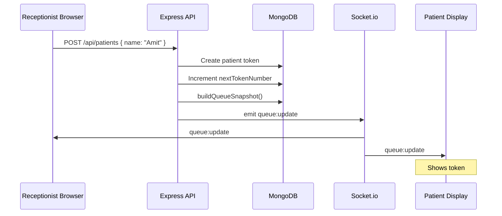

# Socket Events

## Architecture overview

```
┌─────────────────────┐         WebSocket          ┌─────────────────────┐
│  Receptionist View  │◄──────────────────────────►│                     │
│  (React /browser)   │         HTTP REST            │   Express Server    │
└─────────────────────┘◄──────────────────────────►│   + Socket.io       │
                                                    │                     │
┌─────────────────────┐         WebSocket          │   MongoDB           │
│  Patient Waiting    │◄──────────────────────────►│   (queue state)     │
│  Room View          │                              └─────────────────────┘
└─────────────────────┘
```

## Connection lifecycle

```
Client                          Server
  │                               │
  │──── connect ─────────────────►│
  │                               │ join room "clinic:default"
  │◄─── queue:sync (snapshot) ────│  (full state on connect)
  │                               │
  │◄─── queue:update (snapshot) ──│  (after any mutation)
  │                               │
  │──── disconnect ──────────────►│
```

## Events

| Event | Direction | Payload | When |
|-------|-----------|---------|------|
| `queue:sync` | Server → Client | Full queue snapshot | On WebSocket connect / reconnect |
| `queue:update` | Server → Client | Full queue snapshot | After any API mutation (add, call, complete, etc.) |
| `queue:error` | Server → Client | `{ message }` | Failed initial sync |

We broadcast a full snapshot on each change. Keeps both screens in sync and avoids partial-update bugs.

## Mutation → broadcast flow

```
Receptionist clicks "Call Next"
        │
        ▼
POST /api/queue/call-next
        │
        ▼
MongoDB findOneAndUpdate (atomic: lowest waiting token → in_consultation)
        │
        ▼
buildQueueSnapshot()  ── computes wait times, rolling avg, positions
        │
        ▼
io.to("clinic:default").emit("queue:update", snapshot)
        │
        ├──────────────► Receptionist tab updates
        └──────────────► Waiting room tab updates (no refresh)
```

## REST triggers that emit `queue:update`

- `POST /api/patients`
- `POST /api/queue/call-next`
- `POST /api/queue/complete`
- `POST /api/queue/no-show`
- `DELETE /api/patients/:id`
- `PATCH /api/settings/avg-consultation`
- `POST /api/queue/reset-day`

## Snapshot payload (key fields)

```json
{
  "currentToken": 3,
  "currentPatientName": "Priya",
  "waiting": [
    {
      "tokenNumber": 4,
      "position": 1,
      "patientsAhead": 1,
      "estimatedWaitMinutes": 12.5
    }
  ],
  "settings": {
    "effectiveAvgMinutes": 12.5,
    "avgSource": "rolling_average",
    "rollingSampleSize": 8
  }
}
```

## Mermaid: add patient


